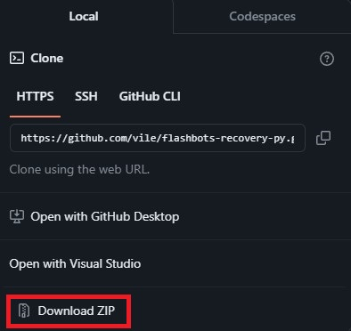

# Flashbots Recovery Py


[](https://github.com/psf/black)
[](https://conventionalcommits.org)

A Python script that uses Flashbots to create Ethereum transaction bundles.
Based off of Flashbots' Python library [example](https://github.com/flashbots/web3-flashbots/blob/master/examples/simple.py).

## Requirements

1. Git - [Install Git](https://git-scm.com/book/en/v2/Getting-Started-Installing-Git)
   1. Check if you have Git installed with `git --version`
2. Python (>=3.10; <4) - [Install Python (Windows)](https://www.python.org/downloads/windows/), [Install Python (Linux)](https://docs.python.org/3/using/unix.html)
   1. Check if you have Python installed with `python3 --version`
3. Pip - [Install Pip](https://pip.pypa.io/en/stable/installation/)
   1. Check if you have Pip installed with `pip --version`
4. Poetry - [Install Poetry](https://python-poetry.org/docs/#installing-with-the-official-installer) (preferrably with [pipx](https://github.com/pypa/pipx))
   1. Check if you have Poetry installed with `poetry --version`

## Usage (Linux)

### Installing

#### Clone this repo

```bash
git clone https://github.com/vile/flashbots-recovery-py.git
cd flashbots-recovery-py
```

#### Install dependencies using Poetry

```bash
make deps
```

#### Rename .env.example

```bash
mv .env.example .env
```

Include your [Alchemy API key](https://www.alchemy.com/), compromised & gasser private keys, and recovery wallet address.

### Running the script

```bash
make start
```

## Usage (Windows)

### Installing

#### Clone this repo (Git)

```bash
git clone https://github.com/vile/flashbots-recovery-py.git
cd flashbots-recovery-py
```

#### Clone this repo (HTTPS)

1. At the top right of the repo on GitHub, click the green `Code` button, then under `HTTPS` click `Download ZIP`.
2. Extract the downloaded archive to a folder like your Desktop using any ZIP tool (such as [WinRAR](https://www.win-rar.com/start.html?&L=0), [7Zip](https://www.7-zip.org/), or [NanaZip](https://github.com/M2Team/NanaZip)).
3. Navigate to the extracted folder.

<details>
<summary>Download repo via HTTPS</summary>
<br>



</details>

#### Install dependencies using Poetry

```bash
poetry install --no-root
```

#### Rename .env.example

Remove the `.example` file extension from the `.env.example` file.
Include your [Alchemy API key](https://www.alchemy.com/), compromised & gasser private keys, and recovery wallet address.

### Running the script

```bash
poetry run py main.py
```

## Creating a Bundle

In most cases, two seperate wallets are required to complete a rescue: a wallet that provides ETH for gas fees (the "gasser" wallet), and the wallet in which assets are being recovered from (the "compromised" wallet).
Providing ETH from a secondary wallet in the same bundle elimates issues with [sweeper bots](https://support.metamask.io/hc/en-us/articles/5716855323675-Fighting-back-against-sweeper-bots).

A transaction bundle is atomic, meaning the bundle will only be mined if all the transactions within the bundle will execute successfully in the same block.

### Providing gas

A simple and generic ETH transfer transaction already exists in [bundle.py](./bundle/bundle.py).
Most of the time, you will only need to change the `value` (amount) of ETH sent (default: `0.01` ETH).
However, if there is a case where the gasser wallet needs to execute multiple transaction before the compromised wallet, it is extensible.

### Rescueing assets

Transactions in `compromised_wallet_txs` completely depend on what interactions are required to rescue assets.
Generic (partial) ABIs are provided for all major ERCs (ERC721, ERC1155, and ERC20), along with a generic batch [transfer contract](https://etherscan.io/address/0xf5028d67221f8d7e09dD53e5F9Aa09a194e33A6f#code).
In the case where transactions interact with non-ERC-conforming tokens or custom contracts, you can either put your own ABI in [utils.abi](./utils/abi.py), or manually construct the calldata and include it in the `data` field of the tx.

#### Incrementing nonce

As each entry in `compromised_wallet_txs` is executed seperately, every new transaction needs to have a properly incremented nonce attached to it. 

<details>
<summary>Incrementing Nonce Between Transactions</summary>

```python
   # transaction 1
   {
      ...
      "nonce": w3.eth.get_transaction_count(
            constants.ETH_COMPROMISED_ACCOUNT_SIGNER.address
        ),
      ...
   },
   # transaction 2
   {
      ...
      "nonce": w3.eth.get_transaction_count(
            constants.ETH_COMPROMISED_ACCOUNT_SIGNER.address
        ) + 1,
      ...
   }
```

</details>

### Examples

Examples are viewable under the [examples folder](./examples/).